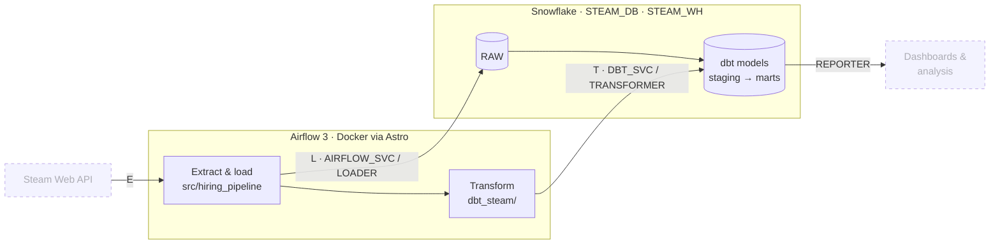

# v0.1 Foundations: Complete ✅

**EDIT** October 5, 2026
Everything in this version are relevant except for mentions of STEAM and the STEAM API. This project has shifted focus and will no longer use anything related to STEAM.

**Completed:** October 2, 2026
**Goal:** Get every tool in the stack talking to every other tool before any Steam data flows.

> **TL;DR:** A single Airflow DAG loads data into Snowflake with the project's own Python package, then runs dbt to transform it. Each step runs as its own least-privilege service user with key-pair authentication, and a monthly cost cap guards the account.

---

## Architecture

The full ELT pipeline this project is building toward. Airflow orchestrates every step; Snowflake stores every layer.



**Solid:** working in v0.1 · **Dashed:** later versions (Steam data arrives in v0.2)

## Tech stack

| Layer | Tool |
|---|---|
| Language | Python 3.14, `src` layout, `pyproject.toml` |
| Warehouse | Snowflake |
| Transformation | dbt Core 1.12 + dbt-snowflake |
| Orchestration | Apache Airflow 3 via Astro CLI (Docker) |
| Quality | pytest, ruff, GitHub Actions CI |

---

## What was built

### Repo and Python
- [x] Installable package (`pip install -e .`) using the **src layout**, so tests run against the installed package rather than loose files
- [x] `pyproject.toml` with separate dependency groups for runtime, `dev` and `dbt`
- [x] `.gitignore` covering secrets, private keys (`*.p8`), dbt artifacts and Airflow logs
- [x] `.env` for secrets (gitignored), with every variable documented in a committed `.env.example`
- [x] pytest and ruff running in **GitHub Actions** on every push

### Snowflake: `snowflake/setup.sql`
- [x] **Re-runnable** infrastructure script (`create ... if not exists` throughout)
- [x] Dedicated X-Small warehouse with 60-second auto-suspend
- [x] **Resource monitor** with a monthly credit cap (notify at 75%, suspend at 100%)
- [x] **Role-based access control** with three roles, future grants and a role hierarchy under `SYSADMIN`:

| Role | Access | Used by |
|---|---|---|
| `LOADER` | Write `RAW` | `AIRFLOW_SVC` |
| `TRANSFORMER` | Read `RAW`, own and build dbt schemas | `DBT_SVC` |
| `REPORTER` | Read marts | BI layer (future) |

### Authentication
- [x] Separate **service users** (`TYPE = SERVICE`) for Airflow and dbt
- [x] **RSA key-pair auth** for all automation; no passwords in code or config
- [x] One key pair per service, so either can be revoked independently
- [x] Private keys never committed; configs reference only file paths

### dbt
- [x] Builds into its own `DEV` schema and never writes to `RAW`
- [x] Containerized profile reads all settings from environment variables, so it's safe to commit
- [x] `dbt debug` passes as `DBT_SVC`, both locally and inside the Airflow container

### Airflow
- [x] Local Airflow 3 running in Docker via Astro CLI, isolated from the project's Python environment
- [x] Snowflake connection using key-pair auth
- [x] dbt installed in a **separate virtual environment inside the image** to avoid dependency conflicts
- [x] `stack_smoke` DAG verifies the full ELT path in one run:

| Task | Proves |
|---|---|
| `import_package` | Airflow can import the project's own Python package |
| `check_snowflake_session` | Correct user, role **and warehouse** are active |
| `write_and_read` | Project code can write to and read from `RAW` as `LOADER` |
| `dbt_build` | Airflow runs dbt, which reads `RAW` and builds a model as `TRANSFORMER` |

---

## Key decisions

| Decision | Choice | Why |
|---|---|---|
| Automation auth | Key-pair over password | Snowflake is retiring password logins for service users, and passwords break under MFA |
| Access model | Separate loader / transformer roles | A bad dbt run can't delete raw data |
| Schema ownership | The role that builds a schema owns it | Avoids mixed-ownership permission errors; admins keep access through the role hierarchy |
| Airflow isolation | Docker via Astro, not `pip install` | Avoids dependency conflicts with dbt |
| Getting `src/` and `dbt_steam/` into Airflow | Read-only volume mounts | Code changes are live with no rebuild. Tradeoff: runtime deps are also listed in `airflow/requirements.txt` |
| Running dbt from Airflow | Separate venv in the image + one bash task | Simplest working integration. Astronomer Cosmos (one task per model) is an option later |
| Shared code design | Functions accept a connection argument | The same code runs locally (key file) and in Airflow (Airflow connection) |

---

## Problems solved along the way

| Symptom | Root cause | Fix |
|---|---|---|
| `dbt debug`: "Profile should not be None" | Ran from the repo root, not the dbt project folder | Run from `dbt_steam/` or pass `--project-dir` |
| `404 Not Found` on login | Wrong account identifier format | Switched to the `ORG-ACCOUNT` identifier |
| `JWT token is invalid` | Public key never registered on the user (a statement failed earlier in the batch) | Registered the key and verified it with `desc user` |
| "No active warehouse" | Container still had stale connection config | Learned that Airflow `.env` changes need a restart |
| dbt: "Schema 'DEV' already exists, but current role has no privileges" | `DEV` was created by an earlier admin-role run, so `TRANSFORMER` didn't own it | Transferred ownership to `TRANSFORMER` |

The `stack_smoke` DAG caught the warehouse issue. An earlier metadata-only test had passed without it, which is why the smoke test asserts on the session's warehouse.

---

## How to verify

```powershell
# Full pipeline (Airflow -> Python -> Snowflake -> dbt)
cd airflow; astro dev start   # then trigger `stack_smoke` at localhost:8080

# Individual pieces, run locally
python scripts/smoke_snowflake.py
cd dbt_steam; dbt debug; dbt build --select smoke_check
```

---

## Next: v0.2

Start ingesting real data: a Steam API client in `src/hiring_pipeline/`, loaded into `RAW` on a schedule by Airflow, with dbt models built on top.